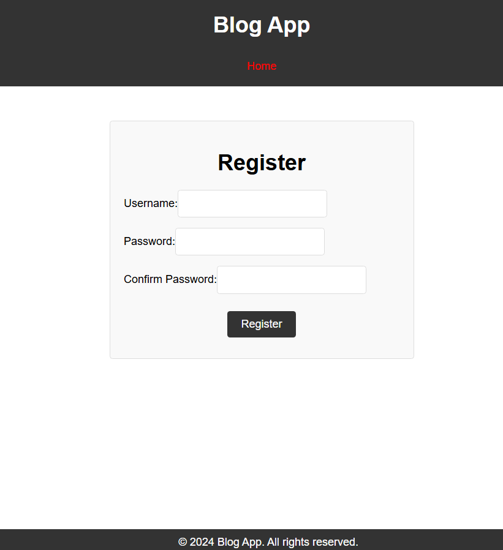
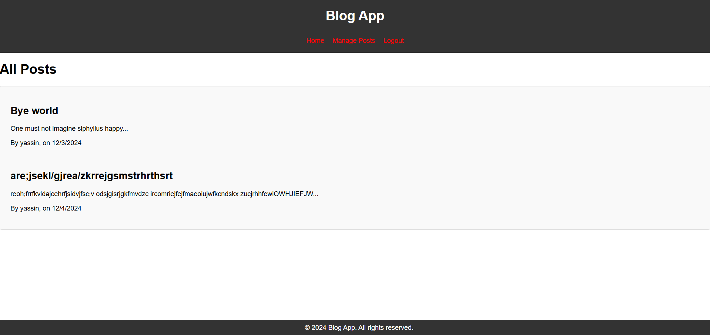
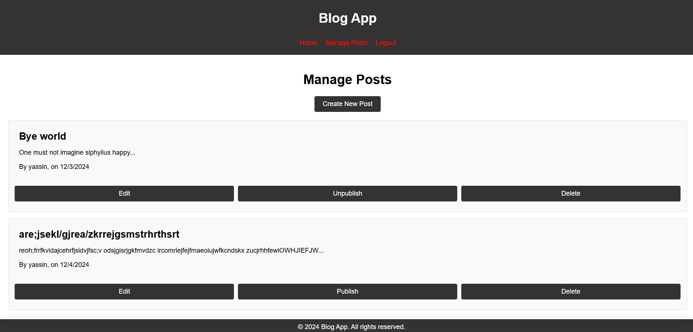
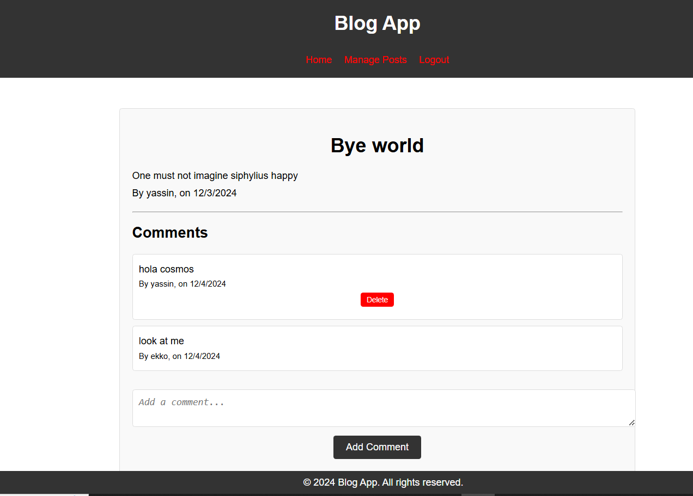

# ✍️ blog_api

Blog web app with a RESTful backend API using **Express** and a bifurcated frontend architecture: a public-facing frontend for user engagement and an admin-only frontend for content management using **React**.

## 📸 Screenshots

    
    
    
    

